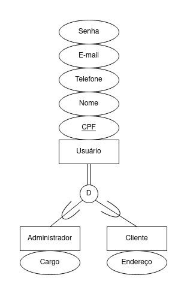
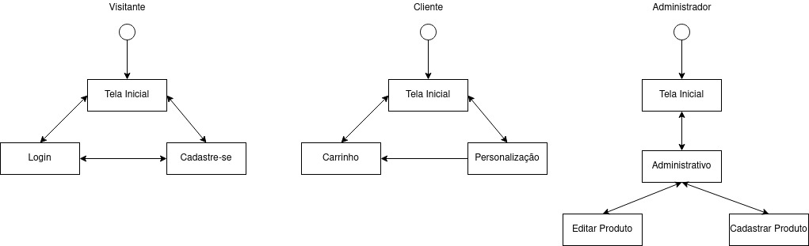

Bruna Magrini da Cruz, 11218813  
Marlon José Martins, 10249010  
Wellington Matos Amaral, 11315054  

Projeto para matéria de Introdução ao Desenvolvimento Web (SCC0219) para o curso de Ciências de Computação da USP São Carlos.

# Loja da Doce Chamego

O sistema é um site para venda de cones trufados e festas na caixa. Os cones trufados são vendidos em diferentes formatos: cone simples, cone cascão, cone na caixa e cone comemorativo (páscoa, natalino, dia das crianças, entre outros). As festas na caixa são produtos com  tema pré-definido (café da manhã, quitutes, caixa bar, vinho, petiscos, entre outros) ou podem ser montadas pelo cliente, escolhendo assim seus itens e decoração.  

## Requisitos

- O sistema deve acomodar dois tipos de usuários: clientes e administradores;
    - Os administradores são responsáveis por registrar e gerenciar administradores e produtos. A aplicação deve começar com uma conta *admin* com senha *admin*;
    - Os clientes são usuários que se cadastram e acessam o sistema para comprar produtos;
- O sistema deve permitir que um administrador cadastre outro. As informações armazenadas sobre um administrador são: *CPF*, *nome*, *telefone*, *e-mail*, *cargo* (podendo ser dono ou vendedor) e *senha*;
- O sistema deve permitir que um cliente se cadastre no mesmo. As informações armazenadas sobre um cliente são: *CPF*, *nome*, *endereço*, *telefone*, *e-mail* e *senha*;
- O sistema deve permitir que o administrador cadastre, consulte, atualize e remova produtos. As informações armazenadas sobre um produto são: *id*, *nome*, *foto*, *descrição*, *preço*, *quantidade em estoque* e *quantidade vendida*. O sistema possui dois tipos de produto: cones trufados e festas na caixa;
    - Cada cone trufado cadastrado possui diferentes sabores associados pré-definidos (leite ninho, nutella, brigadeiro, maracujá, sensação, ovomaltine, limão, paçoca e prestígio);
    - Cada festa na caixa possui diferentes itens associados pré-definidos (doces, bolos, salgados, entre outros). Além disso, a festa na caixa possui um *tamanho* (pequeno, médio ou grande). 
- O sistema deve permitir a venda dos produtos. Para cada produto vendido, a *quantidade vendida* deve ser incrementada e *quantidade em estoque* decrementada conforme a quantidade vendida. Uma venda não pode ser realizada caso não haja a quantidade em estoque necessária;
- O sistema deve conter um carrinho, no qual os produtos selecionados estarão listados com as informações de *nome*, *foto*, *descrição*, *preço* e quantidade selecionada. Além disso, deve ser mostrado o preço total associado a todos os itens. Os carrinhos serão limpos apenas no pagamento ou pelos clientes;
- A venda deve ser paga com um cartão de crédito (qualquer número é aceito pelo sistema);
- O sistema deve permitir a montagem de uma festa na caixa personalizada. Através desta funcionalidade o cliente pode definir quais serão os itens que compõem a festa na caixa e a sua decoração (cores). Além disso, será possível ver o valor total da festa na caixa costumizada;   
- O sistema deve fornecer requisitos de acessibilidade e fornecer boa usabilidade. O sistema deve ser responsivo.

## Descrição 

A plataforma foi implementada com HTML5, CSS3, Javascript e VueJS.

### Armazenamento de Dados

Serão armazenadas na base de dados as informações de usuários e produtos.

**Usuários**

O sistema conta com dois tipos de usuários: administrador e cliente.   
  
Além disso, o sistema conta com o "usuário" não cadastrado, que representa um usuário que não possui associação com a plataforma e apenas pode consultar produtos.

**Há dois usuários mockados: *admin* com senha *admin* e *user* com senha *user*. O primeiro resulta no site para a versão do administrador e o segundo resulta no site para a versão do cliente.**

**Produtos**

O sistema permite a venda de 2 modalidades de produtos: cones e festas na caixa.
 
### Regiões da Aplicação

**Tela inicial**  
Ao acessar a plataforma, o usuário é levado para a tela inicial.   
A partir dessa tela, o usuário consegue visualizar os produtos à venda. Além disso, é possível visualizar informações sobre o contato da empresa .  
Utilizando o menu do sistema, o usuário consegue realizar login na plataforma.

**Tela de login**  
Na tela de login, o usuário consegue acessar a plataforma. Para acessar a plataforma, o usuário deve informar o *usuario* e *senha* cadastrados.   
Após o acesso, clientes e administradores possuem acesso a funcionalidades distintas.  
Além disso, através da tela de login, o usuário consegue acessar a tela de cadastro.

**Tela de cadastro**   
O cadastro na tela de cadastro é realizado por usuários do tipo cliente. 

**Tela administrativa**  
Quando um usuário do tipo administrador acessa a plataforma, ele pode acessar a tela administrativa.  
Na tela administrativa é possível ver uma listagem dos produtos, editá-los e remove-los. Também é possível cadastrar um novo produto.

**Tela de cadastro de produto**  
Quando um usuário do tipo administrador acessa a plataforma, ele pode acessar a tela de cadastro de produto.  
É possível cadastrar um novo produto do tipo cone.

**Tela de editar produto**  
Quando um usuário do tipo administrador acessa a plataforma, ele pode acessar a tela de editar produto.  
É possível editar as informações de um cone.

**Tela de personalização**  
Quando um usuário do tipo cliente acessa a plataforma, ele pode acessar a tela de personalização.  
É possível que o cliente personalize sua própria caixa dentre os três tipos disponibilizados pela loja: festa na caixa, café da manhã e caixa-bar. O cliente pode escolher os componentes e a cor da caixa. O cliente também pode finalizar a personalização.

**Tela de carrinho**  
Quando um usuário do tipo cliente acessa a plataforma, ele pode acessar a tela de carrinho.    
É listado todos os produtos selecionados para compra. Além disso, é possível aumentar a quantidade de um determinado produto, remover ele da lista ou finalizar o pedido.

### Diagrama de Navegação

No diagrama a seguir, os retangulos representam as telas.  


## Comentários Sobre o Código

### Diretórios
- css: arquivos CSS;
- img: imagens utilizadas no código e na documentação;
- templates: templates criados com VueJS que são reutilizados em várias páginas;
- vue: código VueJS criado para cada tela.

### Outras informações

O código foi feito utilizando os conhecimentos adquiridos até a aula 23 da playlist de VueJS (https://www.youtube.com/playlist?list=PLcoYAcR89n-qq1vGRbaUiV6Q9puy0qigW) passada em aula pelo professor.

Para a simulação de login, foi utilizado o Local Storage do navegador.

Foi criado um template de VueJS para o rodapé e o menu. No entanto, como a aplicação não é compilada, o template é apenas um protótipo inicial.

## Teste

Os testes da aplicação back-end serão realizados utilizado `Postman`, `curl` e/ou `REST Client for Visual Studio Code`.

No front-end foram realizados os seguintes testes manuais:
- Verificar se todos os campos obrigatórios requerem o preenchimento para finalização da operação. Como resultado, todos os campos obrigatórios requerem;
- Verificar se os redirecionamentos de páginas estão corretos. Como resultado, os redirecionamentos estão corretos, incluido os do rodapé;
- Verificar se os botões que realizam ações de editar e remover estão corretos. Como resultado, eles realizam as operações corretamente em relação aos dados do mock;
- Verificar o funcionamento das telas no Firefox e Chromium. Como resultado, todas as telas funcionam corretamente em ambos navegadores.

## Processo de Execução

Para execução do sistema, é utilizado o `node-static` (https://www.npmjs.com/package/node-static).   
Para instalá-lo, digite o comando a seguir no terminal:
```
npm install -g node-static 
```
Em seguida, execute o comando a seguir dentro do diretório raiz do projeto para iniciar o site:
```
static -p 8000
```
Após isso, o site estará disponível em http://localhost:8000/.

Outra forma para executar o sistema é abrindo o arquivo `index.html` no navegador.

## Problemas

## Comentários

Como para a segunda entrega apenas é exigido que os dados estejam mockados, algumas funcionalidades não foram implementadas:
- As telas não se comunicam, ou seja, não há a transferência de dados;
- Não é feita validação de acesso a rota proibida. Por exemplo, caso um usuário não administrador tente entrar na rota "/admin.html", não há uma validação. Também não são feitos redirecionamentos.
