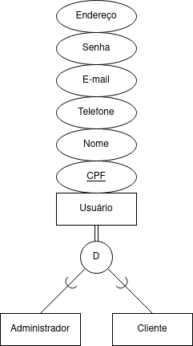
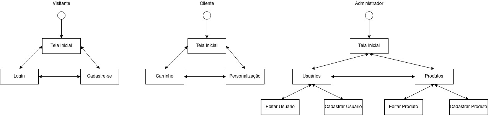

Bruna Magrini da Cruz, 11218813  
Marlon José Martins, 10249010  
Wellington Matos Amaral, 11315054 
 
Projeto para matéria de Introdução ao Desenvolvimento Web (SCC0219) para o curso de Ciências de Computação da USP São Carlos.
 
# Loja da Doce Chamego
 O sistema é um site para venda de cones trufados e festas na caixa. Os cones trufados são vendidos em diferentes formatos: cone simples, cone cascão, cone na caixa e cone comemorativo (páscoa, natal, dia das crianças, entre outros). As festas na caixa são produtos com  tema pré-definido (café da manhã, quitutes, caixa bar, vinho, petiscos, entre outros) ou podem ser montadas pelo cliente, escolhendo assim seus itens e decoração. 
 
## Requisitos
 
- O sistema acomoda dois tipos de usuários: clientes e administradores;
   - Os administradores são responsáveis por registrar e gerenciar administradores, clientes e produtos. A aplicação possui uma conta *admin* com senha *admin*;
   - Os clientes são usuários que se cadastram e acessam o sistema para comprar produtos;
- O sistema permite que um administrador cadastre outro. As informações armazenadas sobre um administrador são: *CPF*, *nome*, *endereço*, *telefone*, *e-mail* e *senha*.  
O sistema permite que um administrador cadastre um cliente. As informações armazenadas sobre um cliente são: *CPF*, *nome*, *endereço*, *telefone*, *e-mail* e *senha*.  
O sistema permite que um administrador consulte, atualize e remova clientes/administradores;
- O sistema permite que um cliente se cadastre no mesmo. As informações armazenadas sobre um cliente são: *CPF*, *nome*, *endereço*, *telefone*, *e-mail* e *senha*;
- O sistema permite que o administrador cadastre, consulte, atualize e remova produtos.   
As informações armazenadas sobre um produto são: *nome*, *preço*, *descrição*, *quantidade* e *fotos*. Note que obrigatoriamente são armazenadas 3 fotos de cada produto. Além disso, o sistema armazena o caminho onde as fotos estão armazenadas, não as fotos em si, por exemplo: `img/cones.jpeg`;   
- O sistema permite a venda dos produtos. Para cada produto vendido, a *quantidade vendida* deve ser incrementada e *quantidade em estoque* decrementada conforme a quantidade vendida. Uma venda não pode ser realizada caso não haja a quantidade em estoque necessária.  
A venda é paga com um cartão de crédito;
- O sistema deve conter um carrinho, no qual os produtos selecionados estarão listados com as informações de *nome*, *foto*, *descrição*, *preço* e quantidade selecionada. Além disso, deve ser mostrado o preço total associado a todos os itens. Os carrinhos serão limpos apenas no pagamento ou pelos clientes;
- O sistema permite a montagem de uma festa na caixa personalizada. Por meio desta funcionalidade o cliente pode definir quais serão os itens que compõem a festa na caixa e a sua decoração (cores) com base em um tema: Festa na Caixa, Café da Manhã ou Caixa-Bar. Além disso, é possível ver o valor total da festa na caixa customizada;  
- O sistema fornece requisitos de acessibilidade e fornecer boa usabilidade. O sistema é responsivo.
 
## Descrição
 
A plataforma foi implementada com HTML5, CSS3, Javascript, VueJS, NodeJS e MongoDB.
 
### Armazenamento de Dados

A base de dados utiliza MongoDB e está hospedada na Cloud (cloud.mongodb.com), na organização da Loja Doce Chamego.  

São armazenadas as informações de usuários e produtos.
 
**Usuários**
 
O sistema conta com dois tipos de usuários: administrador e cliente.  
 

Além disso, o sistema conta com o visitante, que representa um usuário que não possui associação com a plataforma e apenas pode consultar produtos.
 
**Produtos**
 
O sistema permite a venda de 2 modalidades de produtos: cones e festas na caixa.
### Regiões da Aplicação
 
#### **Tela inicial** 
Ao acessar a plataforma, o visitante é levado para a tela inicial.  
A partir dessa tela, o visitante consegue visualizar os produtos à venda. Além disso, é possível visualizar informações sobre o contato da empresa. 
Utilizando o menu do sistema, o visitante consegue realizar login ou cadastro na plataforma.
 
#### **Tela de login** 
Na tela de login, o usuário consegue acessar a plataforma. Para acessar a plataforma, o usuário deve informar o *e-mail* e *senha* cadastrados.  
Após o acesso, clientes e administradores possuem acesso a funcionalidades distintas. 
Além disso, através da tela de login, o usuário consegue acessar a tela de cadastro.
 
#### **Tela de cadastro**  
O cadastro na tela de cadastro é realizado por usuários do tipo cliente.
 
#### **Tela de produtos** 
Quando um usuário do tipo administrador acessa a plataforma, ele pode acessar a tela de produtos. 
Na tela de produtos é possível ver uma listagem dos produtos, editá-los e removê-los. Também é possível cadastrar novos produtos.
 
#### **Tela de cadastro de produto** 
Quando um usuário do tipo administrador acessa a plataforma, ele pode acessar a tela de cadastro de produto. 
É possível cadastrar um novo produto do tipo cone.
 
#### **Tela de editar produto** 
Quando um usuário do tipo administrador acessa a plataforma, ele pode acessar a tela de editar produto. 
É possível editar as informações de um cone.
 
#### **Tela de usuários** 
Quando um usuário do tipo administrador acessa a plataforma, ele pode acessar a tela de usuários. 
Na tela de usuários é possível ver uma listagem dos usuários, editá-los e removê-los. Também é possível cadastrar novos usuários.
 
#### **Tela de cadastro de usuário** 
Quando um usuário do tipo administrador acessa a plataforma, ele pode acessar a tela de cadastro de usuário. 
É possível cadastrar um novo usuário do tipo administrador ou cliente.
 
#### **Tela de editar usuário** 
Quando um usuário do tipo administrador acessa a plataforma, ele pode acessar a tela de editar usuário. 
É possível editar as informações de um usuário.
 
#### **Tela de personalização** 
Quando um usuário do tipo cliente acessa a plataforma, ele pode acessar a tela de personalização. 
É possível que o cliente personalize sua própria caixa dentre os três tipos disponibilizados pela loja: Festa na Caixa, Café da Manhã e Caixa-Bar. O cliente pode escolher os componentes e a cor da caixa. O cliente também pode finalizar a personalização.
 
#### **Tela de carrinho** 
Quando um usuário do tipo cliente acessa a plataforma, ele pode acessar a tela de carrinho.   
É listado todos os produtos selecionados para compra. Além disso, é possível aumentar a quantidade de um determinado produto, remover ele da lista ou finalizar o pedido.
 
### Diagrama de Navegação
 
No diagrama a seguir, os retângulos representam as telas.   

 
## Comentários Sobre o Código
 
### Diretórios do Front-End
- css: Arquivos CSS;
- img: Imagens utilizadas no código e na documentação;
- templates: Templates criados com VueJS que são reutilizados em várias páginas (rodapé e menu);
- vue: Código VueJS criado para cada tela.
 
### Diretórios do Back-End
- bin: Armazena o código do servidor;
- source: Contém os controllers, models, repositories, routes e configurações do servidor.

### Outras informações
 
Para o funcionamento do login, foi utilizado o Local Storage do navegador.
 
## Teste
 
### Back-end
Os testes da aplicação back-end foram realizados utilizando `Postman` e via navegador. 

#### **/usuario** 
- GET /  
Retorna a listagem de usuários;
- GET /:id  
Retorna as informações do usuário com o id correspondente se existir.  
Se não existir, retorna informando que o usuário não existe.
- POST /  
Armazena o usuário.  
Caso algum dos campos não tenha sido preenchido, informa erro;
- PUT /:id  
Atualiza o usuário com base no id.  
Caso o usuário não exista, retorna informando que o usuário não existe.  
Caso algum dos campos não tenha sido preenchido, informa erro;
- DELETE /:id  
Remove o usuário com base no id.   
Caso o usuário não existe, retorna informando que o usuário não existe; 
- POST /authenticate  
Autentica o usuário no banco de dados.  
Caso o usuário não existe ou os dados estejam incorretos, informa acesso negado.

#### **/produto** 
- GET /  
Retorna a listagem de produtos;
- GET /:id  
Retorna as informações do produto com o id correspondente se existir.  
Se não existir, retorna informando que o produto não existe.
- POST /  
Armazena o produto.  
Caso algum dos campos não tenha sido preenchido, informa erro;
- PUT /:id  
Atualiza o produto com base no id.  
Caso o produto não exista, retorna informando que o produto não existe.  
Caso algum dos campos não tenha sido preenchido, informa erro;
- DELETE /:id  
Remove o produto com base no id.   
Caso o produto não existe, retorna informando que o produto não existe; 

### Front-end
 
#### **Navegação**
 
- Visitante: No modo visitante, é permitida a navegação entre a tela inicial, cadastro e login. Foi testado os botões dos menus nas telas;
- Cliente: Com perfil de cliente, é permitida a navegação entre a tela inicial, carrinho e personalização. Foi testado os botões do menu nas telas;
- Administrador: Com perfil de administrador, é permitida a navegação entre a tela inicial, tela de usuários (listagem, edição e cadastro) e tela de produtos (listagem, edição e cadastro). Foi testado os botões do menu nas telas.
 
Além disso, foram testados:
- O logo da marca Doce Chamego localizado no menu que, ao ser clicado, encaminha para a tela inicial;
- O logo da marca Doce Chamego localizado no rodapé que, ao ser clicado, encaminha para a tela inicial;
- O ícone do Instagram e Whatsapp localizado no rodapé que, ao ser clicado, encaminha para as redes sociais da Doce Chamego.
 
#### **Formulários**
 
Foram feitos testes nos formulários de:
- Login: Os campos e-mail e senha são obrigatórios e caso não sejam preenchidos uma mensagem de erro informa a necessidade de preenchimento. Para realização do teste, foi realizada a tentativa de login sem digitar um ou mais dos campos. Além disso, é feita validação se o usuário é válido, ou seja, esta cadastrado no sistema;

- Cadastrar usuário (Visitante): Todos os campos são obrigatórios e caso não sejam preenchidos uma mensagem de erro informa a necessidade de preenchimento. Para realização do teste, foi realizada a tentativa de cadastro sem digitar um ou mais campos. Além disso, o campo CPF exige 11 valores numéricos, o campo e-mail exige um e-mail com formato válido e o telefone exige DDD e o número telefônico. Para realização do teste, foi feita tentativa de cadastro não cumprindo os requisitos descritos anteriormente;
- Personalização: O campo de cor e bebida são os únicos que são digitados pelo usuário e são obrigatórios, se não forem preenchidos uma mensagem de erro informa a necessidade de preenchimento. Para realização do teste, foi realizada a tentativa de adicionar ao carrinho sem digitar algum dos valores. Além disso, a quantidade de bebida só aceita ser alterada via botão no campo e não aceita valores negativos ou maiores que 5. Para realização do teste, foi feita tentativa de inserir valores negativos ou maiores que 5. Note que a seleção se acompanhamento e/ou aperitivos é opcional.
- Administrar usuários: Nesta página serão exibidos todos os usuários cadastrados no banco de dados. A partir desta página é possível navegar entre a página de administração de usuários, cadastro de novos usuários e ainda é possível a exclusão de usuários. Os testes foram realizados conforme a navegação entre as páginas e verificando se o destino está correto, o botão "Editar" redireciona a página de edição de usuários e o botão de "Cadastrar Usuário" redireciona para a página de cadastro de novo usuário; por fim, o botão "Excluir" elimina o usuário da aplicação, este foi testado verificando que o mesmo foi eliminado da lista de usuários cadastrados.
- Cadastrar usuário (Administrador): Diferentemente de quando um visitante se cadastra na plataforma, o administrador, além de poder cadastrar um novo cliente, ele também poderá cadastrar um novo administrador. Todos os campos são obrigatórios e caso não sejam preenchidos uma mensagem de erro informa a necessidade de preenchimento. Para realização do teste, foi feita a tentativa de cadastro sem digitar algum dos valores. Além disso, o campo CPF exige 11 valores numéricos, o campo e-mail exige um e-mail com formato válido, o telefone exige DDD e o número, e o cargo que o novo usuário irá ocupar na aplicação (Cliente ou Administrador). Para realização do teste, foi feita tentativa de cadastro não cumprindo os requisitos;
- Editar usuário: Igualmente a operação do administrador cadastrar um novo usuário, os mesmos campos serão apresentados, logo, todos os campos são obrigatórios e foram testados da mesma forma que a operação de cadastro descrita anteriormente!
- Administrar produtos: Nesta página serão exibidos todos os produtos cadastrados no banco de dados. A partir desta página é possível navegar entre a página de administração de produtos, cadastro de novos produtos e ainda é possível a exclusão de produtos. Os testes foram realizados conforme a navegação entre as páginas e verificando se o destino está correto, o botão "Editar" redireciona a página de edição de produtos e o botão de "Cadastrar Produto" redireciona para a página de cadastro de novo produto; por fim, o botão "Excluir" elimina um produto da aplicação, este foi testado verificando que o mesmo foi eliminado da lista de produtos cadastrados.
- Cadastrar produto: Todos os produtos apresentados na tela inicial, ou seja, que estão disponíveis para comprar, foram inicialmente cadastrados pelo administrador. Para cadastrar um novo produto é necessário preencher todos os campos e caso não sejam preenchidos uma mensagem de erro informa a necessidade de preenchimento. Para realização do teste, foi feita a tentativa de cadastro sem digitar um ou mais dos campos. Além disso, o preço deve ser maior ou igual a R$0,01, a quantidade em estoque deve ser maior ou igual a 1 e todos os produtos possuem uma breve descrição. Para realização do teste, foi feita tentativa de cadastro não cumprindo os requisitos descritos anteriormente;
- Editar produto: Igualmente a operação do administrador cadastrar um novo produto, os mesmos campos serão apresentados, logo, todos os campos são obrigatórios e foram testados da mesma forma que a operação de cadastro descrita anteriormente!
- Carrinho:
  - Todos os campos sobre os dados do cartão são obrigatórios e caso não sejam preenchidos uma mensagem de erro informa a necessidade de preenchimento. Para realização do teste, foi feita a tentativa de cadastro sem digitar um ou mais dos campos. Além disso, o número do cartão exige 16 dígitos, o CVV exige 3 dígitos e a validade do cartão deve ser maior que a data atual. Para realização do teste, foi feita tentativa de cadastro não cumprindo os requisitos descritos anteriormente;
  - O botão de "Remover" exclui o item referente a ele do carrinho de compras; para alterar a quantidade de um produto é necessário que inserir a quantidade desejada na caixa numérica e, após isso, clicar no botão "Adicionar" para validar a operação e atualizar quantidade do item na compra. Para a realização do teste foi feita a inserção de valores inválidos como letras, números negativos, zero e excessivamente grandes (maior do que 30); ao violar alguma dessas condições, o usuário será informado do problema e orientado a colocar um valor válido. Além disso, o usuário apenas pode colocar uma quantidade que esteja disponível, caso o valor seja maior, uma notificação é retornada;  
  - Por fim, o checkbox "Este pedido é um presente" é uma validação para mudar a embalagem do envio, em um caso real seria uma embalagem especial, ele foi testado verificando o resultado da finalização do pedido com o checkbox marcado, onde a mensagem explicita que o envio será especial e, caso contrário, apenas a mensagem padrão será exibida.
 
#### **Outros**
 
- Foi testado o campo de pesquisa de produtos por nome na tela inicial. Para realização do teste, foram digitados: 
   - Textos maiusculos e minusculos: Não é feita diferenciação;
   - Acentos: Letras com acento e sem acento são tratadas como diferentes;
   - Nenhum caractere é ignorado, ou seja, ao digitar espaço ou caracteres especiais, a pesquisa utiliza esse caractere para realizar a busca;
   - Nome de produto que não existe: Não é retornado nenhum produto;
   - Nome de produto que existe: É retornado o produto desejado, sendo o nome de produto digitado procurado em qualquer parte do título do produto.
- Foi testado o botão "Adicionar ao carrinho" na tela inicial. Para a realização do teste, foram feitas as seguintes verificações:
   - Caso o usuário não esteja logado (visitante), o sistema informa uma mensagem informando que o visitante deve acessar a plataforma e encaminha para a tela de login;
   - Caso o usuário esteja logado como administrador, o sistema informa uma mensagem de usuário inválido para a operação e permanece na tela de inicial;
   - Caso o usuário esteja logado como cliente, o sistema informa uma mensagem de item adicionado ao carrinho e encaminha para a tela de carrinho;
   - Caso o usuário cliente tente adicionar um produto que já está no carrinho, uma notificação é retornada.
 
#### **Compatibilidade**
 
- Verificar o funcionamento das telas no Firefox e Chromium. Como resultado, todas as telas funcionam corretamente em ambos navegadores.
 
## Processo de Execução

### Back-End
Para a execução, é utilizado o `npm` (https://www.npmjs.com/) e NodeJS.    
Após a instalação dos aplicativos, acesse o diretório `backend` e digite os seguintes comandos:

Para instalar as dependências:
```
npm install
```
Para iniciar a aplicação:
```
npm start
```

### Front-End
Para execução do sistema, é utilizado o `node-static` (https://www.npmjs.com/package/node-static).  
Para instalá-lo, digite o comando a seguir no terminal:
```
npm install -g node-static
```
Em seguida, execute o comando a seguir dentro do diretório `frontend` para iniciar o site:
```
static -p 8000
```
Após isso, o site estará disponível em http://localhost:8000/.

### MongoDB
Como o MongoDB está hospedado na Cloud, não é necessário executá-lo.
 
## Problemas
 
Não há.

## Comentários
 
- Não é feita validação de acesso a rota proibida. Por exemplo, caso um usuário não administrador tente entrar na rota "/admin.html", não há uma validação;
- No Projeto 2, o login era gerenciado via LocalStorage. Como a váriavel "usuario" que armazenava o login teve o formato modificado (agora sendo um JSON) pode acontecer de navegadores que executaram a versão 2 do Projeto apresentarem problemas de leitura da mesma. Uma das consequências disto é a não apresentação do menu. Se este for o caso, basta limpar o LocalStorage acessando o console da página e dar F5 ou, para uma solução temporária, abrir o sistema em uma página anonima. Foi implementado um tratamento para resolver esta situação.  
 

