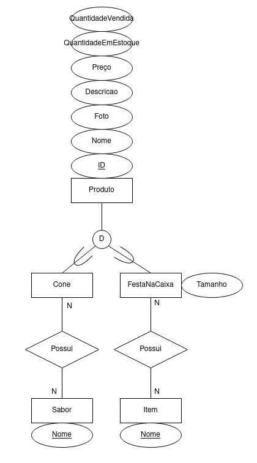

Bruna Magrini da Cruz, 11218813  
Marlon José Martins, 10249010  
Wellington Matos Amaral, 11315054   dddddddd

Projeto para matéria de Introdução ao Desenvolvimento Web (SCC0219) para o curso de Ciências de Computação da USP São Carlos.

# Loja da Doce Chamego 

O sistema é um site para venda de cones trufados e festas na caixa. Os cones trufados são vendidos em diferentes formatos: cone simples, cone cascão, cone na caixa e cone comemorativo (páscoa, natalino e dia das crianças). As festas na caixa são produtos com  tema pré-definido (café da manhã, quitutes, caixa bar, vinho e petiscos) ou podem ser montadas pelo cliente, escolhendo assim seus itens e decoração.   
A plataforma foi implementada com HTML5 e CSS3.

## Requisitos

- O sistema deve acomodar dois tipos de usuários: **clientes** e **administradores**;
    - Os administradores são responsáveis por registrar e gerenciar administradores, clientes e produtos. A aplicação deve começar com uma conta *admin* com senha *admin*;
    - Os clientes são usuários que acessam o sistema para comprar produtos;
- O sistema deve permitir que um administrador cadastre outro. As informações armazenadas sobre um administrador são: *CPF*, *nome*, *telefone*, *e-mail*, *cargo* (podendo ser dono ou vendedor) e *senha*;
- O sistema deve permitir que um cliente se cadastre no mesmo. As informações armazenadas sobre um cliente são: *CPF*, *nome*, *endereço*, *telefone*, *e-mail* e *senha*;
- O sistema deve permitir que o administrador cadastre, consulte, atualize e remova produtos. As informações armazenadas sobre um produto são: *id*, *nome*, *foto*, *descrição*, *preço*, *quantidade em estoque* e *quantidade vendida*. O sistema possui dois tipos de produto: cones trufados e festas na caixa;
    - Cada cone trufado cadastrado possui diferentes sabores associados. Tais sabores devem ser cadastrados previamente no sistema (leite ninho, nutella, brigadeiro, maracujá, sensação, ovomaltine, limão, paçoca, prestígio, entre outros);
    - Cada festa na caixa possui diferentes itens associados. Tais itens devem ser cadastrados previamente no sistema (refrigerante, suco, doces, bolos, salgados, entre outros). Além disso, a festa na caixa possui um *tamanho* (pequeno, médio ou grande); 
- O sistema deve permitir a venda dos produtos. Para cada produto vendido, a *quantidade vendida* deve ser incrementada e *quantidade em estoque* decrementada conforme a quantidade vendida. Uma venda não pode ser realizada caso não haja a quantidade em estoque necessária;
- O sistema deve conter um carrinho, no qual os produtos selecionados estarão listados com as informações de *nome*, *foto*, *descrição*, *preço* e quantidade selecionada. Além disso, deve ser mostrado o preço total associado a todos os itens. Os carrinhos serão limpos apenas no pagamento ou pelos clientes;
- A venda deve ser paga com um cartão de crédito (qualquer número é aceito pelo sistema);
- O sistema deve permitir a montagem de uma festa na caixa personalizada. Através desta funcionalidade o cliente pode definir quais serão os itens que compõem a festa na caixa e a sua decoração (cores e enfeites). Além disso, será possível ver o valor total da festa na caixa costumizada;   
- [?] O sistema deve permitir a listagem das compras realizadas pelo usuário;
- O sistema deve fornecer requisitos de acessibilidade e fornecer boa usabilidade. O sistema deve ser responsivo.

## Descrição 

O sistema conta com dois tipos de usuários: administrador e cliente. 

## Comentários Sobre o Código

## Teste

### Plano de Teste

### Resultados dos Testes

## Processo de Execução

## Problemas

## Comentários

